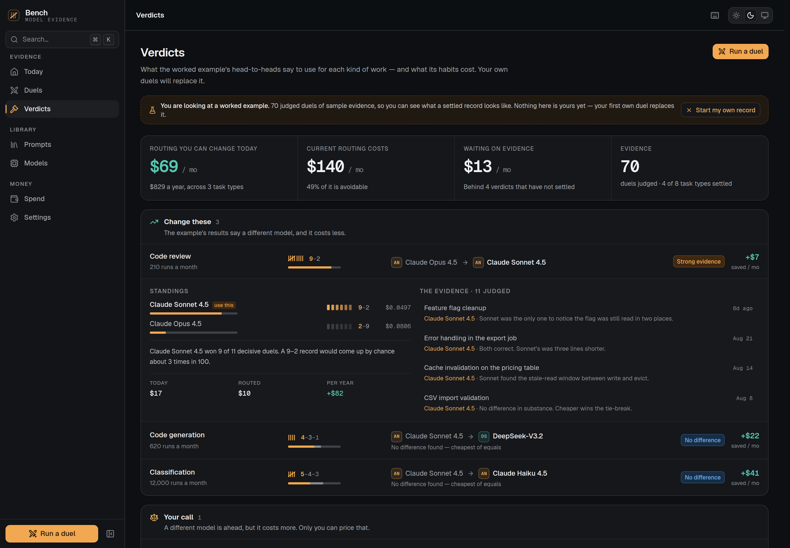
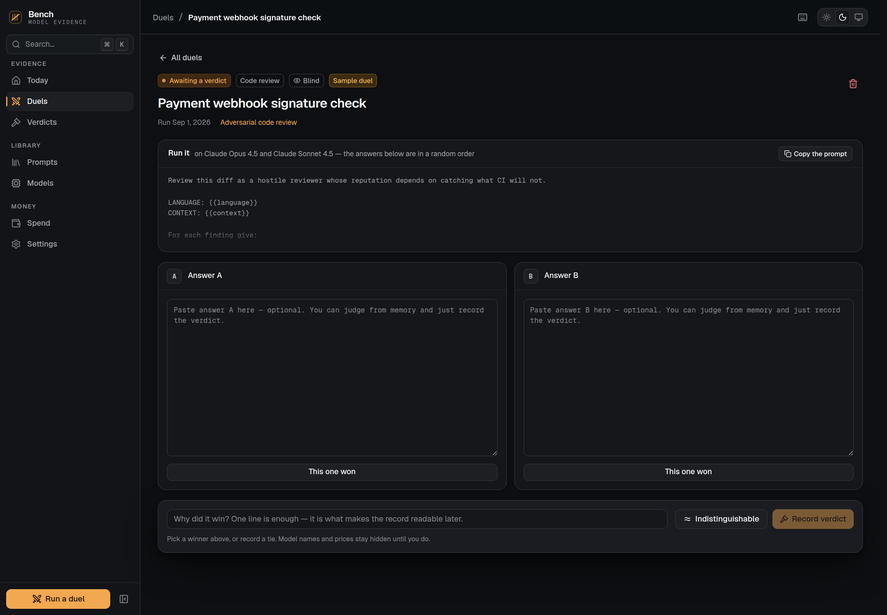
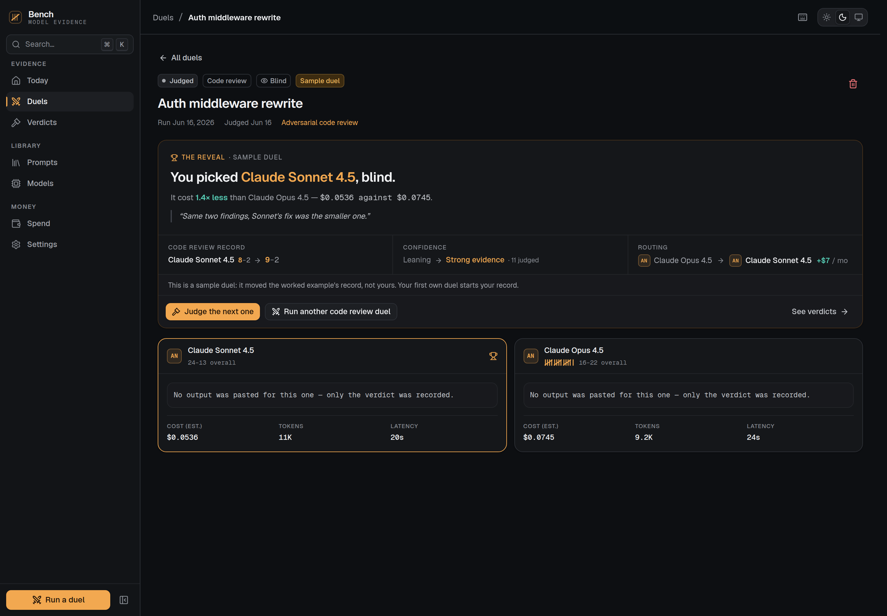
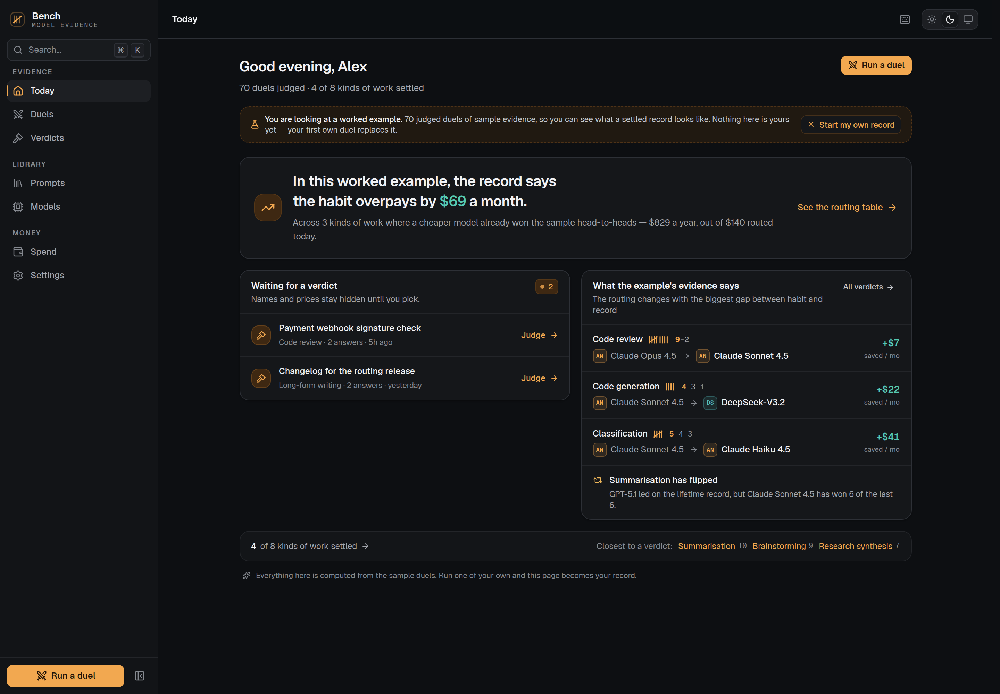

# Bench

**Which model actually wins your work.**

Every model decision you make is a guess against a benchmark of somebody else's
tasks. Bench turns the work you are already doing into blind head-to-heads,
records who won, and compounds that into a routing table — plus the number your
guessing is costing you.



> **Prototype.** Everything runs locally in the browser. No account, no server,
> and no provider API is ever called — you run the prompt in whichever apps you
> already use and record the verdict. Model prices are illustrative snapshot
> values, and the workspace opens on a labelled worked example so the routing
> table is not empty on day one. The first duel you run yourself replaces it
> with your own record — the two are never mixed.

---

## The loop

```
You have a task that matters      →   run it as a duel, not a guess
        ↓
You get the answer you needed     →   and you saw the alternatives
        ↓
One click picks the winner        →   blind: no names, no prices
        ↓
The record thickens               →   task type, winner, cost delta, your reason
        ↓
A verdict settles                 →   "Sonnet beats Opus on code review, 9–2"
        ↓
You change the routing            →   and Bench keeps testing whether it still holds
```

The mechanic that makes it work is that **model identity and price stay hidden
until you have chosen**. If you can see that column B is the expensive one, you
will pick it, and the record it produces is worth nothing.

## What it does

### Verdicts — the routing table

For each kind of work: what your own head-to-heads say to use, the record behind
it, honest confidence, and the monthly delta. Grouped by what you should *do*
about it — **change these** / **your call** / **already right** / **not settled**
— because a table sorted alphabetically is a spreadsheet, not a recommendation.

Every row expands to the duels behind it. A recommendation you cannot audit is
just another opinion, and the whole pitch is that this one is yours.

Confidence is an exact binomial against a coin flip, stated in words rather than
notation: *"A 9–2 record would come up by chance about 3 times in 100."* Four
states, each with a different action:

| State | Means | Do |
|---|---|---|
| **Strong evidence** | The record beats chance | Route to the winner |
| **No difference** | Enough tries to have found a gap, and none showed | Route to the cheapest of equals |
| **Leaning** | One is ahead, not by enough | Run a few more |
| **Early signal** | Fewer than five results | It is a guess, not a verdict |

The second row is where most of the money is: a cheap model does not have to be
*better*, only *not worse*. Every row also carries its reason in one sentence —
*"Sonnet won 9 of 11 decisive duels"*, *"Level across 12 duels, so price
decides"* — because a recommendation you cannot repeat to a colleague is not one
you will act on.

### Duels — where evidence is made



Pick a task and two to four models. Bench shows you the prompt to run and hides
which answer came from which — presentation order is shuffled by a hash of the
duel id, so "A" is never reliably the one you added first. Paste the answers back
or judge from memory; the verdict is the part that compounds.



Cost, latency and names are revealed together, after the verdict — and the
reveal says what the click meant: what you picked and what it cost against what
it beat (*"1.4× less than Claude Opus 4.5"*), what it did to this kind of work's
record (*8–2 → 9–2, Leaning → Strong evidence*), what it means for routing, and
then the way out: judge the next open duel, run another of the same kind, or
read the verdicts. The whole screen exists so that gets clicked.

### Today



Three questions and nothing else. *What can I do now* — the open duels, one
click each. *What has the evidence learned* — the routing changes it supports,
and any reversal. *Does it change how I work* — how settled the record is, and
which kinds of work are one result away from a verdict. No activity feed, no
spend gauge; those live on their own pages. Until your first own duel, every
sentence says "worked example" rather than "your record".

### Models, Prompts, Spend

- **Models** — your win–loss record and recent form sit *ahead* of the vendor's
  specs, and the default sort is by that record.
- **Prompts** — each carries which model wins *it*, computed from the duels that
  used it. "Run as a duel" is the primary action.
- **Spend** — budget, forecast, provider and project breakdowns, the transaction
  ledger and subscriptions, with a card bridging to how much of the bill your own
  evidence says is avoidable.

---

## Who this is for

**ICP.** Someone who puts AI *into* something — an indie developer shipping AI
features, a consultant billing for AI output, a technical founder. They spend
$150–600/month across four or more providers, and model choice is a recurring
engineering decision with a cost line attached. A casual ChatGPT user makes that
decision once; this person makes it monthly.

**The pain.** They pick models by vibes and vendor benchmarks that do not
reflect their work, over-provision "to be safe", and cannot justify the choice to
anyone. At volume that is real money and no argument.

**The alternative today.** Two browser tabs, an eyeball comparison, and the
result forgotten by Thursday. Or a public leaderboard measuring someone else's
tasks. Or nothing.

**Why not Notion / ChatGPT Projects / Claude Projects.** Those are places to keep
things, and one of them cannot compare itself against a competitor. Bench is
structurally cross-provider: no vendor will ever build a tool whose main output
is "use the other one for this".

---

## Stack

| | |
|---|---|
| Framework | Next.js 15 (App Router) · React 19 |
| Language | TypeScript, strict |
| Styling | Tailwind CSS v4, CSS-first tokens (no `tailwind.config.js`) |
| Components | Radix where accessibility is genuinely hard; hand-built otherwise |
| Charts | Hand-written SVG — no charting dependency |
| State | Zustand, one store, one write path |
| Storage | `localStorage` behind a swappable adapter interface |
| Tests | Vitest + Testing Library + jsdom |
| Accessibility | axe-core via Playwright, every route, both themes |

No animation library, no chart library, no UI kit. 103 kB of shared JS.

## Architecture

```
src/
├── app/                  Routes. Shell is static; data views are client components.
├── components/
│   ├── ui/               Primitives, including the record/tally marks
│   ├── charts/           Hand-written SVG charts
│   ├── layout/           Sidebar, top bar, mobile nav, theme, shell
│   ├── command/          Command palette and its preview pane
│   └── onboarding/       First run, which opens on a real blind comparison
├── features/             duels · verdicts · models · prompts · spending · projects
├── lib/
│   ├── data/             Domain types, adapter interface, seeded corpus
│   ├── analytics/        verdicts.ts (routing) · evidence.ts (example vs own) · spend.ts
│   ├── providers/        pricing.ts (one place a run is priced) · DuelRunner seam · registry
│   ├── search/           Fuzzy matcher, index, list-filter predicate
│   ├── prompts/          Template engine and line diff
│   └── store/            Zustand stores
└── hooks/
```

**Data never lives in components.** One seam:

```
WorkspaceAdapter ──→ Zustand store ──→ selectors ──→ components
      │                    │
 load/save/clear      mutate → log activity → debounced persist
```

`LocalStorageAdapter` today, `MemoryAdapter` in tests, Supabase or Postgres later
— with no component changes.

See [`docs/architecture.md`](docs/architecture.md) for the statistics, the
evidence mode, the provider seam, the forecast model and why search uses two
different algorithms.
[`docs/design.md`](docs/design.md) covers the visual system.
[`docs/product.md`](docs/product.md) is the strategy: the critique that produced
this pivot, the loop, the ICP and the pricing hypothesis.

---

## Getting started

```bash
npm install
npm run dev            # http://localhost:3000
```

First run is a real blind comparison — pick the better of two answers before you
know what produced them. Then the workspace loads a labelled worked example of 72
duels so the routing table has something in it. The first duel you run yourself
replaces it with your own record; a button clears it sooner. Press `d` anywhere
to start one.

### Scripts

| Command | What it does |
|---|---|
| `npm run dev` | Development server |
| `npm run build` | Production build |
| `npm start` | Serve the production build |
| `npm test` | Run the test suite |
| `npm run typecheck` | `tsc --noEmit` |
| `npm run lint` | ESLint |
| `npm run check` | typecheck → tests → build |
| `npm run a11y` | axe scan, every route, both themes (needs a server) |
| `npm run responsive` | Overflow sweep, 8 widths × 12 routes (needs a server) |
| `npm run deadcode` | knip scan for unused files, exports and dependencies |
| `npm run screenshots` | Regenerate the captures in `screenshots/` |

## Tests

357 tests across 26 files. The verdict engine is tested hardest, because it is
the product: exact binomial probabilities, each confidence state and the
boundaries between them, the equivalence rule that stops "not significant" from
swallowing a real signal, reversal detection, the money maths, and the sentence
each verdict gives as its reason.

The judging screen has an explicit test that **no model name and no price
appears while a verdict is pending** — that guarantee is the reason the data is
worth anything, so it is asserted rather than assumed. The reveal is tested for
the record delta and the next-step links; Today for saying "worked example"
until the record is the user's and for never claiming a saving before there is
evidence; the store for the one-way switch from example to own record; the
provider seam for pricing and runner dispatch.

Writing the suite has surfaced eight real defects across both phases, each fixed
with a regression test. See the git log.

---

## Roadmap

In rough order of value:

- **Provider-connected duels.** Run the comparison from inside Bench instead of
  copy-paste. Cuts the friction that is the whole risk of the product. The seam
  is in place (`lib/providers`): a provider is a `DuelRunner` plus one
  `registerRunner` call, and entries already record whether their numbers were
  estimated or measured.
- **Usage ingestion.** Read real volumes from provider APIs, so the savings
  number stops depending on an estimate the user typed.
- **Routing export.** Emit the verdict table as a config a gateway can consume,
  so the recommendation becomes the behaviour.
- **Team ledgers.** Shared evidence, per-project verdicts, and an audit trail for
  "why are we on this model".
- **Judge assistance.** A model proposing the verdict for you to confirm, which
  raises throughput but has to be kept clearly separate from human verdicts in
  the record.

## Licence

MIT.
