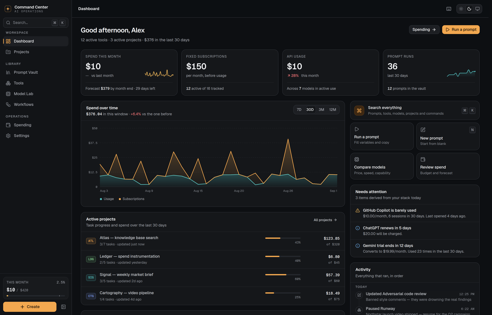
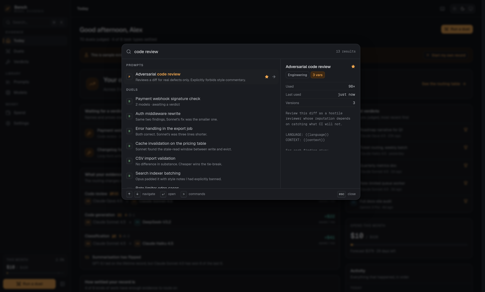
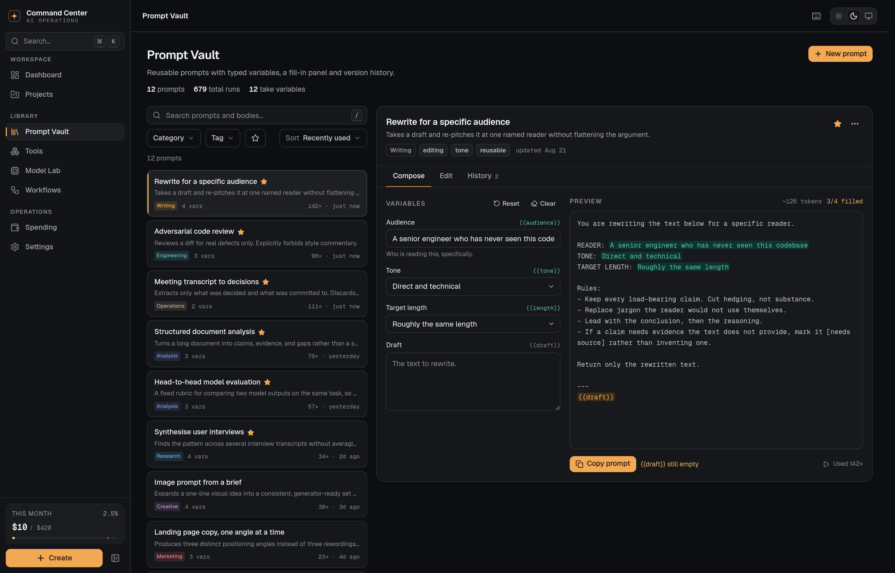
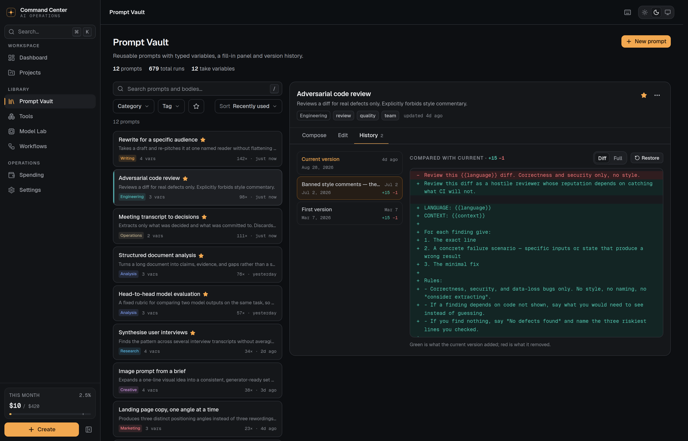
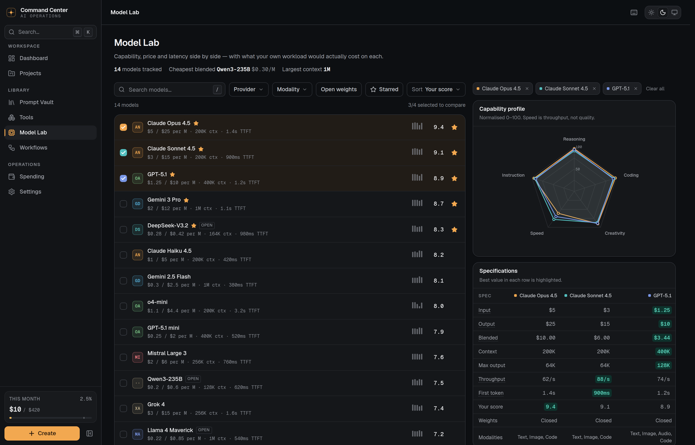
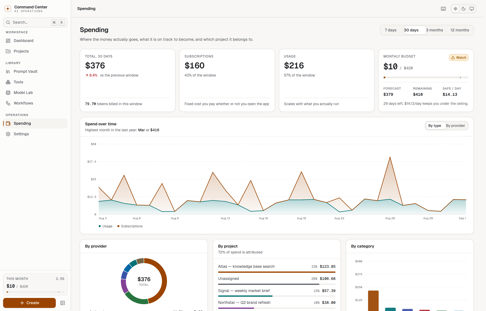
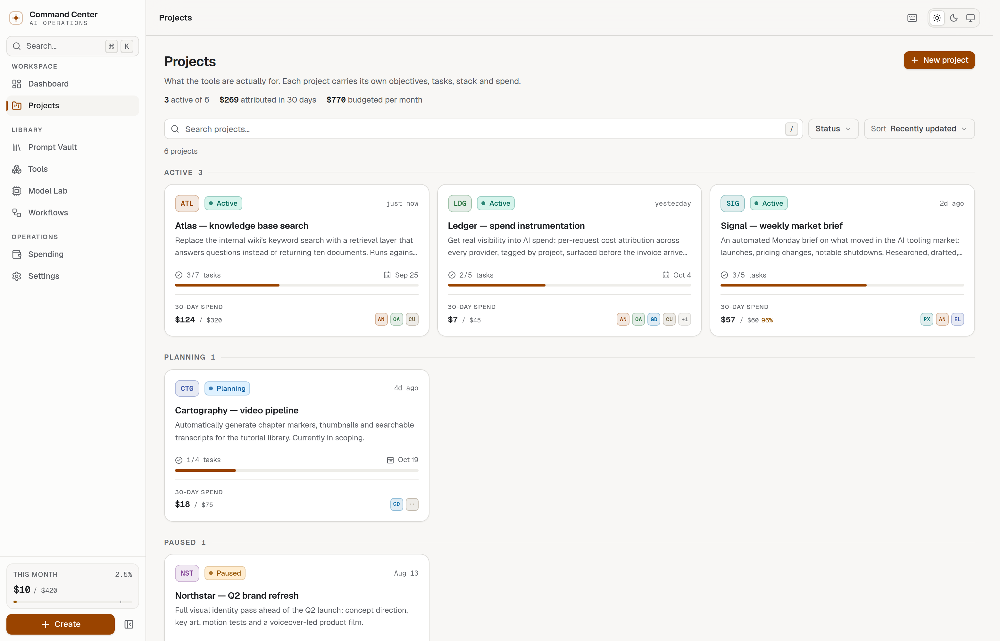
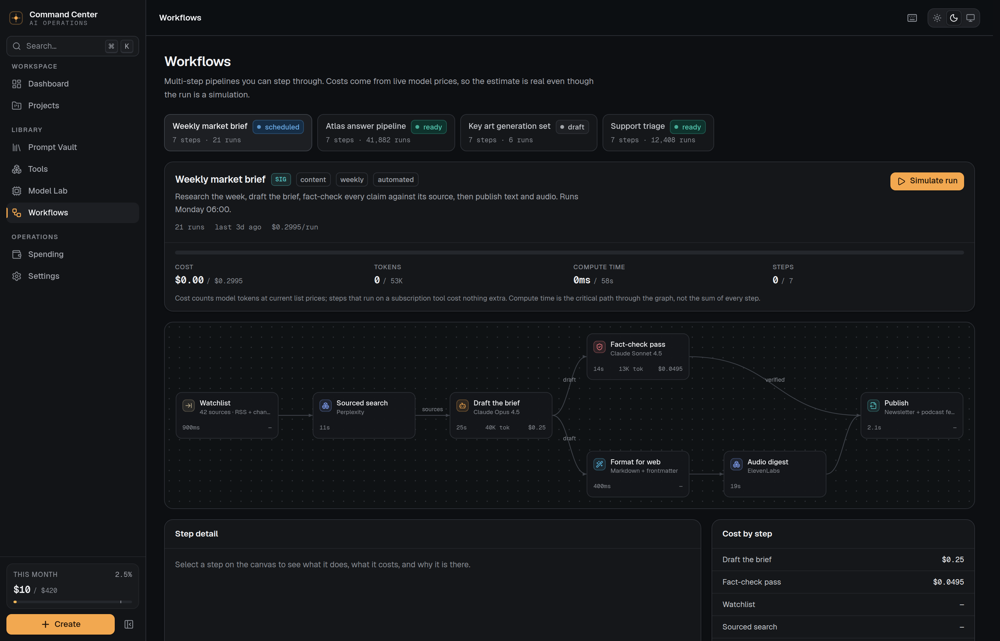
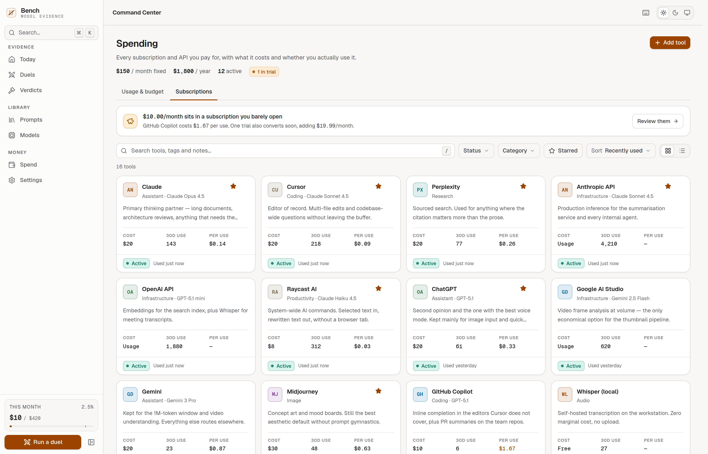
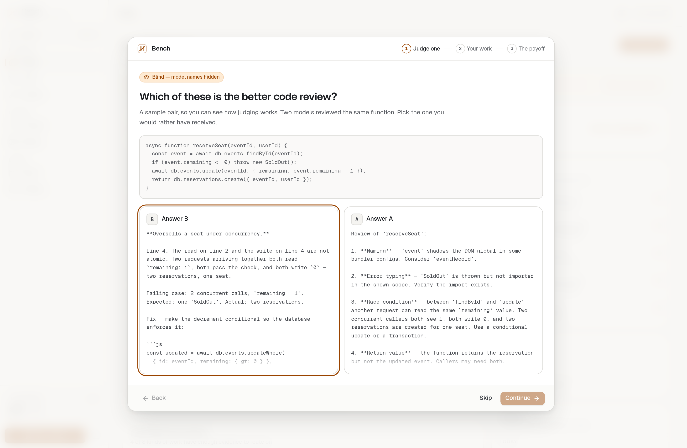

# AI Command Center

A personal cockpit for AI work: every tool you pay for, every model you compare,
every prompt you reuse, every project they serve, and what the whole thing
costs — in one place.

Most people running on AI have their prompts in a notes app, their spend
invisible until the card statement, and no memory of which model was best for
what. This is the instrument panel for that.



> **Prototype.** Everything runs locally in the browser. There is no account, no
> server, and no provider API is ever called. Model prices, capability scores and
> spend history are illustrative seed data, generated from a fixed seed. The
> storage layer is a single adapter interface, so pointing it at a real backend
> is a file, not a rewrite.

---

## What it does

### Dashboard — answers three questions before you click anything

What am I spending, what needs a decision today, and what just happened.

The **Needs attention** panel is derived, not decorative: trials with a date on
them, subscriptions nobody has opened, projects past 80% of their budget, overdue
tasks, renewals inside five days — each computed from real state and sorted by
urgency. The month-end forecast accounts for subscription renewal dates rather
than naively extrapolating spend-per-day, and the month-to-date delta compares
day 1..N against day 1..N of the previous month, so it stays honest on the 3rd.

### Command palette — `⌘K`



One field searches every prompt, project, tool, model and workflow, plus every
action the app can perform. Type `>` for commands only.

Matched characters are highlighted, not just ranked. The right-hand pane previews
whatever is selected — a model's pricing and context window, a tool's status and
last use, a prompt's body — so the palette answers questions without navigating
anywhere. Empty state shows genuinely recent items, derived from the activity log.

### Prompt Vault



A prompt library is only worth having if you can run what is in it, so
**Compose** is the default tab: typed variables (text, long text, select,
number), a live preview that marks filled values green and unfilled placeholders
amber, a token estimate, and copy-to-clipboard that records a real run.

**Edit** reconciles variable definitions from the body as you type, flagging
which placeholders are new and which will be dropped. **History** keeps every
previous body with a note and shows a real line diff against the current one —
two bodies side by side tell you nothing about a prompt where one rule changed.



### Model Lab



Select up to four models — capped there because a fifth overlaid radar stops
being readable — and compare capability profiles, a spec table that highlights
the winner in each row, and a **workload cost calculator**: chat / summarise /
review / classify presets or your own token counts, showing what each model would
cost per month and how long it would take. The spread between the cheapest and
most expensive option is usually the whole argument.

### Spending



Budget with a month-end forecast marked on the bar, the daily rate that lands
exactly on the ceiling, spend stacked by type or provider over 7D/30D/3M/12M,
breakdowns by provider, project and category — including how much spend is
actually attributed — and a searchable transaction ledger with token counts.

### Projects



What the tools are actually for. Objectives, checkable tasks with overdue states,
a spend trend attributed to the project alone, its own budget, and the prompts,
tools, models and workflows it uses.

### Workflows



Multi-step pipelines on an SVG canvas that fits itself to the viewport. **Simulate
run** steps through the graph — completed edges turn accent, the active edge
animates, pending steps dim — while cost, tokens, compute time and step count
count up against the estimate.

Costs are computed from current model list prices and each step's token counts,
so the estimate is real even though nothing is executed. Compute time is the
critical path through the graph, not the sum of every step, so parallel branches
are not double-counted.

### Tools



Grid or table, with cost-per-use computed for every subscription and flagged
above $1.50. The insight strip at the top sums the money sitting in
barely-used tools, names the worst offender, and folds in trials about to
convert — and only appears when there is something to say.

### Onboarding



Five steps, and every choice has a consequence: unpicked tools drop to
*evaluating*, chosen models get starred so the Model Lab opens on them, and the
budget drives the sidebar meter from the first screen.

---

## Stack

| | |
|---|---|
| Framework | Next.js 15 (App Router) · React 19 |
| Language | TypeScript, strict |
| Styling | Tailwind CSS v4, CSS-first tokens (no `tailwind.config.js`) |
| Components | Radix primitives where accessibility is genuinely hard; hand-built otherwise |
| Charts | Hand-written SVG — no charting dependency |
| State | Zustand, one store, one write path |
| Storage | `localStorage` behind a swappable adapter interface |
| Fonts | Geist Sans + Geist Mono, self-hosted |
| Tests | Vitest + Testing Library + jsdom |
| Accessibility | axe-core via Playwright, every route, both themes |

No animation library, no chart library, no UI kit. 103 kB of shared JS; pages
land between 150 and 190 kB first load.

---

## Architecture

```
src/
├── app/                  Routes. Shell is static; data views are client components.
├── components/
│   ├── ui/               Primitives — Button, Card, Dialog, Segmented, …
│   ├── charts/           Hand-written SVG charts
│   ├── layout/           Sidebar, top bar, mobile nav, theme, shell
│   ├── command/          Command palette and its preview pane
│   └── onboarding/       First-run flow
├── features/             Feature-scoped components (tools, models, prompts, …)
├── lib/
│   ├── data/             Domain types, adapter interface, seeded workspace
│   ├── analytics/        Pure functions: spend, budgets, forecasting, attention
│   ├── search/           Fuzzy matcher, search index, list-filter predicate
│   ├── prompts/          Template engine: variables, rendering, reconciliation
│   └── store/            Zustand stores
└── hooks/
```

**Data never lives in components.** Everything goes through one seam:

```
WorkspaceAdapter ──→ Zustand store ──→ selectors ──→ components
      │                    │
 load/save/clear      mutate → log activity → debounced persist
```

`LocalStorageAdapter` today, `MemoryAdapter` in tests, a Supabase or Postgres
implementation later — with no component changes, because no component knows
where a workspace comes from.

See [`docs/architecture.md`](docs/architecture.md) for the decisions behind the
forecast model, the two different search algorithms, and why the charts are
hand-written. [`docs/design.md`](docs/design.md) covers the visual system.

---

## Getting started

```bash
npm install
npm run dev            # http://localhost:3000
```

First run walks through a short setup, then loads a workspace with ~13 months of
plausible history so nothing is empty. Everything is stored in your browser;
Settings can export it as JSON, import it back, or reset to the sample data.

### Scripts

| Command | What it does |
|---|---|
| `npm run dev` | Development server |
| `npm run build` | Production build |
| `npm start` | Serve the production build |
| `npm test` | Run the test suite |
| `npm run test:watch` | Watch mode |
| `npm run typecheck` | `tsc --noEmit` |
| `npm run lint` | ESLint |
| `npm run check` | typecheck → tests → build |
| `npm run a11y` | axe scan over every route, both themes (needs `npm run dev`) |
| `npm run responsive` | Horizontal-overflow sweep, 8 widths × 9 routes (needs `npm run dev`) |
| `npm run deadcode` | knip scan for unused files, exports and dependencies |
| `npm run screenshots` | Regenerate the captures in `screenshots/` |

---

## Tests

220 tests across 12 files. Pure logic is tested directly and heavily; UI tests
cover behaviour a user would notice.

```
Analytics    range windows, bucketed series, breakdowns, month-end forecast
             including renewal dates, budget state, safe daily rate, model
             cost and latency estimation, formatters
Search       fuzzy scoring and highlight segments, index building, the
             list-filter predicate, grouping and relevance ordering
Templates    variable extraction, rendering, segment rendering, reconciliation
Store        every mutation: versioning, restore, duplication, cascading
             deletes, activity logging, onboarding, reset
Attention    each derived signal and its severity ordering
UI           command palette keyboard model and grouping, prompt composer
             fill-and-copy, tools filtering and editing, model comparison and
             its cost calculator, navigation state
```

Writing them surfaced five real defects — a rounding error that lost a cent, the
palette activating the wrong result on Enter, list filters that excluded nothing,
and two accessibility bugs. All are fixed, and each has a regression test.

---

## Roadmap

Deliberately out of scope for a prototype, in rough order of value:

- **A real backend.** Write a `SupabaseAdapter` against the existing interface;
  multi-device sync and sharing follow from it.
- **Live usage ingestion.** Pull actual spend from provider usage APIs instead of
  seeded figures, and reconcile against invoices.
- **Prompt runs against real models.** The Compose tab currently copies; sending
  it and storing the response would make version history far more useful.
- **Team workspaces.** Shared prompt libraries, per-seat attribution, roles.
- **Workflow execution.** The canvas already models steps, costs and gates; an
  execution engine behind it is the natural next step.
- **Evaluation runs.** Score a prompt across several models on a fixed rubric and
  keep the history — the Model Lab's personal scores are a manual stand-in.

---

## Licence

MIT.
